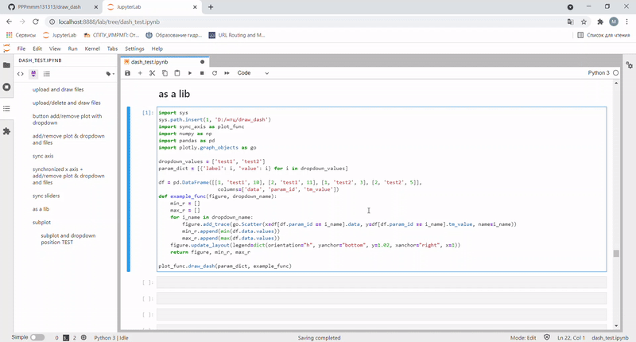

# Dash

### function to draw dash with add/remove plot & dropdown and files

### original funcs in main.py

## Libs

[pip installed](https://pip.pypa.io/en/stable/installation/)

```bash
pip install numpy 
pip install pandas 
pip install dash 
pip install dash_html_components 
pip install dash_core_components
pip install plotly 
```

## Example

### second y-axis and synchronize x-axis

#### run second_ax_sync.py


### just sync axis

#### sync_axis.py



